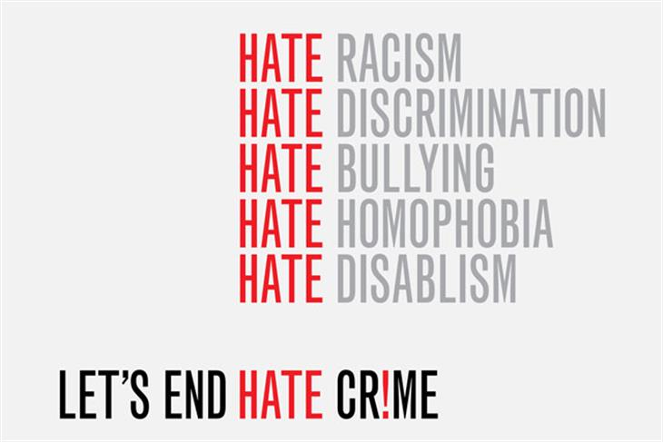

***

##Background
Over the past few years, the United States has been facing increased divisions amongst its citizens due to ethnic, racial, sexual, and other prejudices. Many articles indicate that Trump's election into presidency and the overall shift in political power, have fostered an environment wherein these harmful sentiments could circulate. We wanted to see if the number of hate crimes reflected the seemingly endless reports of discrimination that flood the news. Additionally, we sought to find whether Trump's election played a part in the change in the number of hate crimes. 

##Data Source

-  We collected annual hate crime  data from [FBI](https://ucr.fbi.gov/hate-crime), ranging from [2005](https://ucr.fbi.gov/hate-crime/2005) to [2017](https://ucr.fbi.gov/hate-crime/2017).

-  To predict the relationship between hate crime data and ocioeconomic issues, we select  factors  and collected the related data as following:
   
    - [Median annual household income](https://www.kff.org/other/state-indicator/median-annual-income/?currentTimeframe=0&sortModel=%7B%22colId%22:%22Location%22,%22sort%22:%22asc%22%7D)
    
    - [Share of the population that is unemployed](https://www.kff.org/other/state-indicator/unemployment-rate/?currentTimeframe=2&sortModel=%7B%22colId%22:%22Location%22,%22sort%22:%22asc%22%7D)

    - [Share of the population with high school degree](https://www.census.gov/prod/2012pubs/p20-566.pdf)

    - [Share of the population that are not U.S. citizens](https://www.kff.org/other/state-indicator/distribution-by-citizenship-status/?currentTimeframe=1&sortModel=%7B%22colId%22:%22Location%22,%22sort%22:%22asc%22%7D)
    
    - [Share of the population that is white](https://www.kff.org/other/state-indicator/distribution-by-raceethnicity/?currentTimeframe=0&sortModel=%7B%22colId%22:%22Location%22,%22sort%22:%22asc%22%7D)

- To compare the hate crime rate before and after election and explore whether Trump's election influence the hate crimes, we collected data as following:

    - [The hate crime rate from 11.09.2016 to 11.18.2016(10 days after election)](https://www.splcenter.org/20161129/ten-days-after-harassment-and-intimidation-aftermath-election)
    
    - [Share of 2016 U.S. presidential voters who voted for Donald Trump](https://projects.fivethirtyeight.com/2016-swing-the-election/)

## Conclusion
In conclusion, this project showed that hate crimes are currently on an upward trend. Though our findings were not able to prove President Trump as the sole cause for this increase, they did indicate that the 2016 election played a part in increasing the rate of hate crime in the U.S. The rise in the number of hate crimes is alarming, and can serve as an indicator of the increasing divisions and discriminative sentiments amongst subgroups in the U.S. 

 

***
## Overview

<iframe width="560" height="315" src="http://youtu.be/wGQlzGs4FTg?hd=1" frameborder="0" gesture="media" allow="encrypted-media" allowfullscreen></iframe>
